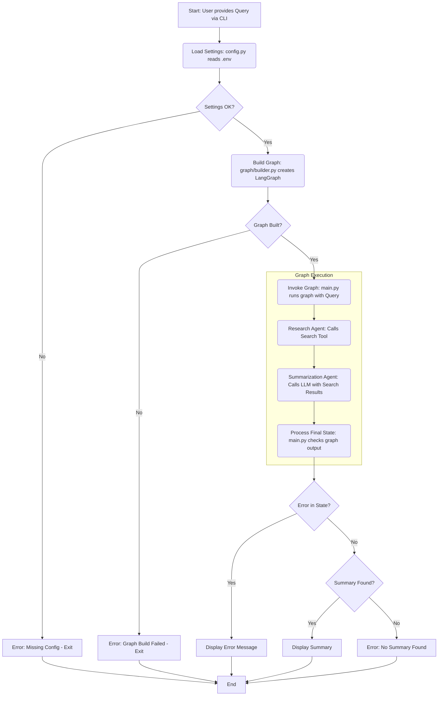

# PydanticAI Research App - Application Flow

## 1. Introduction

This document illustrates the execution flow of the PydanticAI Research Application. It shows the sequence of steps from receiving a user query to generating the final summary, including configuration loading, graph execution (with agent interactions), and error handling, primarily based on the logic in `main.py` and the workflow described in `README.md`.

## 2. Workflow Diagram

The following diagram visualizes the application's workflow, including the agent steps within the graph:

## 3. Workflow Steps Explained

1.  **Start (User Query):** The process begins when a user provides a research query via the command line (`main.py`). If no query is given, a default one is used.
2.  **Load Settings (`config.py`):** The application attempts to load necessary configurations (API keys, model names) from the `.env` file using `config.py`.
3.  **Settings Check:** It verifies if critical settings (like `LLM_API_KEY` and `SEARCH_API_KEY`) were successfully loaded (`main.py`, lines 31-34). If not, it prints a critical error and exits.
4.  **Build Graph (`graph/builder.py`):** If settings are valid, the application calls `build_graph` (defined in `graph/builder.py`) to construct the LangGraph execution graph (`main.py`, line 38). This graph defines the agents and their connections.
5.  **Graph Build Check:** It checks if the graph was built successfully (`main.py`, lines 40-42). If `build_graph` returns `None` or fails, it prints a critical error and exits.
6.  **Invoke Graph (`main.py`):** The main application logic invokes the built graph using `research_graph.invoke(initial_input)`, passing the user's query (`main.py`, lines 46-53). The graph then executes its defined steps:
    *   **Research Agent (`agents/researcher.py`):** This agent node receives the query, uses the configured search tool (e.g., Tavily) via its API key to find relevant online information, and adds the search results to the graph's state.
    *   **Summarization Agent (`agents/summarizer.py`):** This agent node receives the search results from the state, uses the configured LLM (e.g., GPT) via its API key to process the results, generates a summary conforming to the `SummaryResult` schema (defined in `agents/schemas.py`), and adds the summary object to the graph's state.
7.  **Process Final State:** After the graph finishes execution (or encounters an internal error), `main.py` retrieves the final state dictionary (`main.py`, line 53). The structure of this state is defined in `graph/state.py`.
8.  **Error Check (State):** It checks the final state dictionary for an `error_message` key (`main.py`, lines 72, 75-76). If an error message exists, it's displayed.
9.  **Summary Check:** If no `error_message` was found in the state, it checks for a `final_summary` key containing a valid `SummaryResult` object (`main.py`, lines 73, 82).
10. **Display Result:**
    *   If an `error_message` was found, the error is printed, and the application exits with an error code (`main.py`, lines 76, 81, 116-117).
    *   If no error occurred and a valid `final_summary` is found, the summary is printed, and the application exits successfully (`main.py`, lines 83-86, 112-114).
    *   If no error occurred but no valid `final_summary` is found (unexpected state), an error message is printed, and the application exits with an error code (`main.py`, lines 88-91, 116-117).
11. **End:** The application terminates, indicating success (exit code 0) or failure (exit code 1).